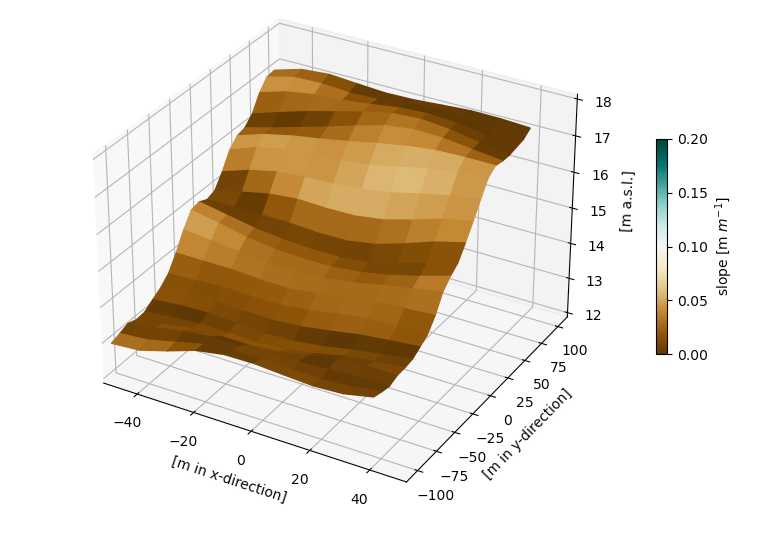

## Hillsope generator

<p align="center">

</p>

Generates an artificial hillslope. The following hillslope shapes are
available:
- straight
- concave
- convex
- noisy

## Usage
**First step:**
Download the repository and install required Python packages in an environment:
```bash
git clone https://github.com/Hydrology-IFH/hillslope_generator.git
cd hillslope_generator
conda env create -f conda-environment.yml
```
IMPORTANT: Add the folder containing the package to your PYTHONPATH! Modify
your .bashrc-file.

**Second step:**
Activate the anaconda environment and and move into the direcory of
hillslope_generator:
```bash
conda activate hillgen
```
**Straight hillslope**
```bash
python hillslope_generator.py --hillslope-shape straight --nrows 12 --ncols 24 --bottom 10 --top 20 --cell-width 10 --write-output
```
**Concave hillslope**
```bash
python hillslope_generator.py --hillslope-shape concave --nrows 12 --ncols 24 --bottom 10 --top 20 --cell-width 10 --write-output
```
**Convex hillslope**
```bash
python hillslope_generator.py --hillslope-shape convex --nrows 12 --ncols 24 --bottom 10 --top 20 --cell-width 10 --write-output
```
**Noisy hillslope**
```bash
python hillslope_generator.py --hillslope-shape noisy --nrows 12 --ncols 24 --bottom 10 --top 20 --cell-width 10 --write-output
```

## License
This software can be distributed freely under the MIT license. Please read the LICENSE for further information.
© 2022, Robin Schwemmle (<robin.schwemmle@hydrology.uni-freiburg.de>)
